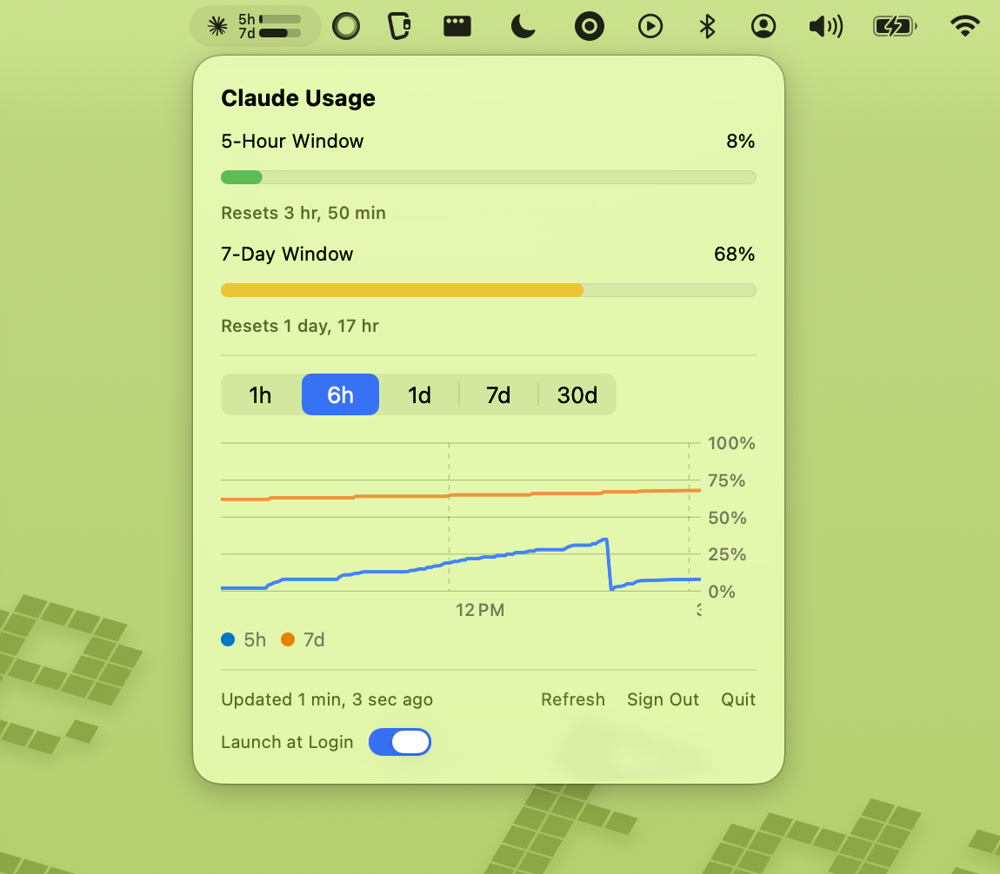

<p align="center">
  
</p>

<h1 align="center">Claude Gusage</h1>

<p align="center">See your Claude usage at a glance, right in the macOS menu bar.<br>
Minimal black · white · red design with a colour‑coded mini bar.</p>

<p align="center">
  
  
  
</p>

<p align="center">
  
</p>

> A friendly fork of [**Blimp-Labs/claude-usage-bar**](https://github.com/Blimp-Labs/claude-usage-bar) by Krystian, with a renamed identity (**Claude Gusage**), a black/white/red theme, a colour‑coded menu bar bar, and notifications for critical model‑scoped limits (e.g. Fable). See [Credits](#credits).

---

## What it does

A tiny macOS menu bar app that shows your Claude usage without opening a browser. Click it for the full picture.

- **Menu bar mini‑bar** — a compact dual bar for your 5‑hour and 7‑day utilization, **colour‑coded by usage**:
  - 🟢 **green** below 50%
  - 🟡 **yellow** at 50–75%
  - 🔴 **red** at 75%+
- **Detailed popover** — per‑window usage, per‑model breakdown (Opus / Sonnet), reset timers, and Extra Usage credits in USD.
- **Model‑scoped limits** — surfaces limits that have no dedicated bucket (e.g. **Fable**), straight from the live API.
- **Usage history chart** — watch usage evolve over 1h / 6h / 1d / 7d / 30d, with hover‑to‑inspect exact values.
- **Notifications** — get alerted when:
  - a window (session / weekly / Sonnet / Design / extra) crosses a threshold you set,
  - a **model‑scoped limit becomes critical** (e.g. Fable hits its cap),
  - the weekly limit is about to reset (~10h before).
- **Just sign in** — OAuth through your browser, no API keys to paste or manage.
- **Light footprint** — SwiftUI, Swift Charts, Foundation, and Sparkle for updates.

## Install

### Option A — download (easiest)

1. Grab `ClaudeGusage.dmg` from the [latest release](../../releases/latest).
2. Open the disk image and drag the app into **Applications**.
3. First launch: right‑click the app → **Open** (it's an unsigned build, so macOS asks once).

### Option B — build from source

Requires **macOS 14+** and **Swift 5.9+** (Xcode 15+ or the Command Line Tools).

```sh
git clone https://github.com/dagdelenardic-ops/claude-gusage.git
cd claude-gusage
make app        # build the .app bundle
make install    # copy it into /Applications
# or: make dmg  # build a drag‑to‑Applications disk image
```

## Usage

1. Launch the app — a small icon appears in the menu bar.
2. Click it → **Sign in with Claude** → authorize in your browser.
3. Paste the code back into the app.
4. The bar updates automatically (default: every 30 minutes; configurable in Settings).

Open **Settings** (from the popover) to set notification thresholds, toggle the critical‑limit and weekly‑reset alerts, choose the polling interval, and enable Launch at Login.

## Data & privacy

Everything stays on your Mac. Nothing is sent anywhere except the Anthropic API you're already using.

| Location | Purpose |
|----------|---------|
| `~/.config/claude-usage-bar/token` | OAuth access token (file mode `0600`) |
| `~/.config/claude-usage-bar/history.json` | Usage history for the chart (30‑day retention) |

History is buffered in memory and flushed to disk every 5 minutes and on quit.

## Development

```sh
make build      # release build only
make app        # build + create the .app bundle
make dmg        # build + package a DMG
make install    # build + install to /Applications
make clean      # remove build artifacts
```

Run the tests with `cd macos && swift test` (needs a full Xcode toolchain for `XCTest`).

## Credits

Built on top of [**claude-usage-bar**](https://github.com/Blimp-Labs/claude-usage-bar) by **Krystian** (Blimp Labs), used under the BSD 2‑Clause License. This fork keeps the original author's copyright notice — see [`LICENSE`](LICENSE) — and adds the Claude Gusage rebrand, the black/white/red theme, the colour‑coded menu bar bar, and critical model‑limit notifications.

Not affiliated with Anthropic. "Claude" is a trademark of Anthropic; this is an unofficial, community tool.

## License

[BSD 2‑Clause](LICENSE) © 2026 Krystian, and contributors to this fork.
